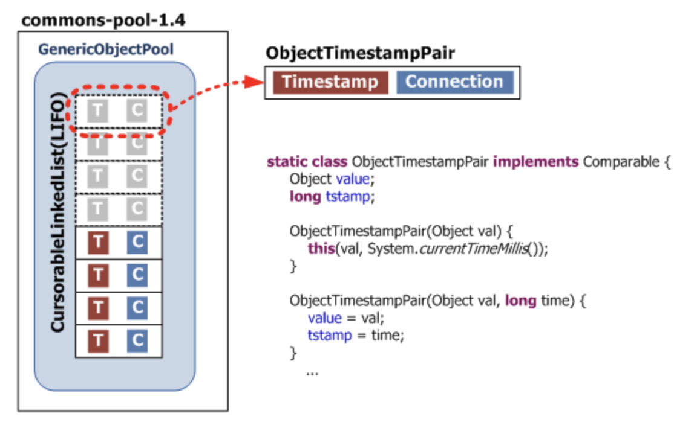
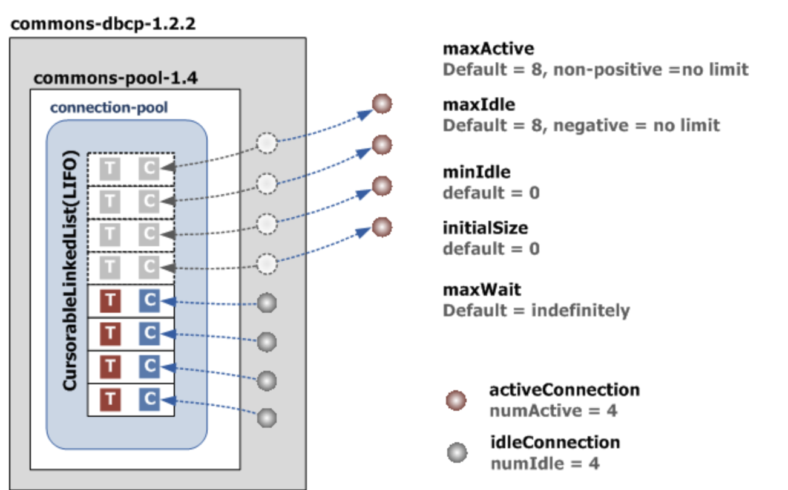

웹 애플리케이션에서 데이터베이스와 연결을 맺을 때마다 Conenction을 생성한다면 많은 비용이 들뿐만 아니라, 
Connection 관리를 직접해줘야 되는 단점이 존재한다.

이를 해결하기 위해 Connection Pool을 사용하는데, 여러 오픈 소스 라이브러리가 존재한다.(Apache Commons DBCP, Tomcat-JDBC, HikariCP) 

또한, Connection Pool을 적절히 사용하기 위해선 구조와 원리에 대해 알고 있어야 한다. 
사내에서 Apache Commons DBCP사용하므로 이에 대해 알아보자.

## Commons DBCP 속성 설정
- initialSize : 최초 시점에 getConnection() 를 통해 커넥션 풀에 채워 넣을 커넥션 개수 (default = 0)
- maxTotal (1.x에서는 maxActive): 동시에 사용할 수 있는 최대 커넥션 개수 (default = 8)
- maxIdle : Connection Pool에 반납할 때 최대로 유지될 수 있는 커넥션 개수 (default = 8)
- minIdle : 최소한으로 유지할 커넥션 개수 (default = 0)
- maxWaitMillis (1.x에서는 maxWait) : pool이 고갈되었을 경우 최대 대기 시간 (ms단위, default = -1 = 무한정)이걸 설정하지 않았는데, pool이 고갈되었고, 엔드유저의 요청은 계속 들어온다면? 
tomcat 스레드 풀이 고갈되어 죽는다. 엔드유저 요청마다 무한정 대기중일 테니... 
대부분 Connection의 개수 및 대기 상태일 때 설정값이 대부분이다.  
Connection Pool 구조에 대해 더 알아보자

## Connection 구조
먼저 Connection Pool 구조는 아래와 같다.

Commons DBCP는 PoolableConnection 타입의 커넥션을 생성하고 생성한 커넥션에 ConnectionEventListener를 등록한다.  
ConnectionEventListener에는 애플리케이션이 사용한 커넥션을 풀로 반환하기 위해 JDBC 드라이버가 호출할 수 있는 콜백 메서드가 있다.  
이렇게 생성된 커넥션은 commons-pool의 addObject() 메서드로 커넥션 풀에 추가된다.  
이때 commons-pool은 내부적으로 현재 시간을 담고 있는 타임스탬프와 추가된 커넥션의 레퍼런스를 한 쌍으로 하는 ObjectTimestampPair라는 자료구조를 생성한다.  
그리고 이들을 LIFO(last in first out) 형태의 CursorableLinkedList로 관리한다.

만약 8개의 커넥션을 최대로 활용할 수 있을 때, 4개는 사용 중이고 4개는 대기 중인 상태라면 커넥션 풀의 상태는 아래와 같다.

개수와 관련해서 몇 가지 조건이 존재한다. 
- maxActive >= initialSize
maxActive = 10이고 initialSize = 20이라고 가정하면 최초에 커넥션을 생성할 때 initialSize 값이 최대 커넥션 개수인 maxActive 값보다 커서 논리적으로 오류가 있는 설정이다.
- maxIdle >= minIdle
maxIdle < minIdle로 설정할 수는 있지만 최솟값이 최댓값보다 커서 논리적으로 오류가 있는 설정이다.
- maxActive = maxIdle
maxActive 값과 maxIdle 값이 같은 것이 바람직하다. maxActive = 10이고 maxIdle = 5라고 가정해 보자. 
항상 커넥션을 동시에 5개는 사용하고 있는 상황에서 1개의 커넥션이 추가로 요청된다면 maxActive = 10이므로 1개의 추가 커넥션을 데이터베이스에 연결한 후 풀은 비즈니스 로직으로 커넥션을 전달한다. 
이후 비즈니스 로직이 커넥션을 사용 후 풀에 반납할 경우, maxIdle=5에 영향을 받아 커넥션을 실제로 닫아버리므로, 일부 커넥션을 매번 생성했다 닫는 비용이 발생할 수 있다.

maxActive 값은 DBMS의 설정과 애플리케이션 서버의 개수, Apache, Tomcat에서 동시에 처리할 수 있는 사용자 수 등을 고려해서 설정해야 한다

## 유효성 검사 쿼리 설정
JDBC 커넥션의 유효성은 validationQuery 옵션에 설정된 쿼리를 실행해 확인할 수 있다.   
- testOnBorrow: 커넥션 풀에서 커넥션을 얻어올 때 테스트 실행(기본값: true) 
- testOnReturn: 커넥션 풀로 커넥션을 반환할 때 테스트 실행(기본값: false) 
- testWhileIdle: Evictor 스레드가 실행될 때 (timeBetweenEvictionRunMillis > 0) 커넥션 풀 안에 있는 유휴 상태의 커넥션을 대상으로 테스트 실행(기본값: false) 

validateQuery 옵션에는 아래와 같이 DB별로 Validation Query로 실제 테이블에 있는 데이터를 조회하지 않도록 설정해야 한다.

- Oracle: select 1 from dual
- Microsoft SQL Server: select 1
- MySQL: select 1
- CUBRID: select 1 from db_root

## statement pooling 관련 옵션
poolPreparedStatements 옵션을 true로 설정해서 Commons DBCP를 커넥션 풀뿐만 아니라 statement pool로도 사용할 수 있다.  
이때는 반드시 maxOpenPreparedStatements 옵션을 같이 사용해 커넥션당 풀링할 PreparedStatement의 적절한 개수를 설정해야 한다.   
그렇지 않으면 런타임에서 메모리 부족(out of memory) 오류 등이 발생할 수 있다.  

maxOpenPreparedStatements 값은 문제가 발생지 않도록 50 정도로 작게 설정한 후 데이터베이스 관리자의 도움을 얻어 PreparedStatement의 캐시 적중률(hit ratio)을 관찰한 후 조정하기를 권장한다.   
여기서 설정한 PreparedStatement 개수는 개별 커넥션마다 할당된다.   
즉 커넥션 풀에 10개의 커넥션이 있을 때 maxOpenPreparedStatements = 50이라면 총 10 x 50 = 500개의 PreparedStatement가 캐시에 저장된다.   
절대 BasicDataSource 클래스에 설정되는 개수가 아니다.  

### 출처
[Commons DBCP 이해하기](https://d2.naver.com/helloworld/5102792)