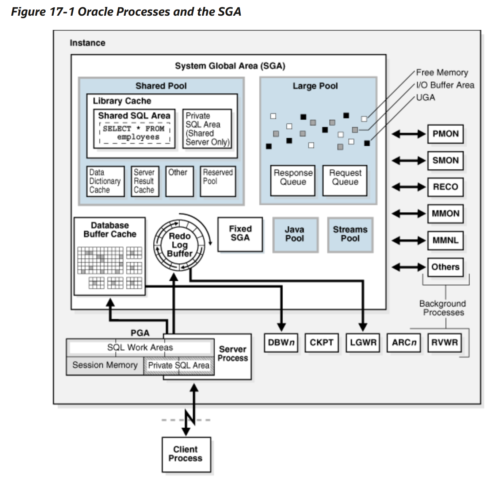

## DB Process & Thread

### Oracle Process

- Process는 OS에 따라 달라진다
- 오라클 프로세스는 오라클 데이터베이스 코드를 실행하는 실행 단위입니다.
[Process Architecture (oracle.com)](https://docs.oracle.com/en/database/oracle/oracle-database/21/cncpt/process-architecture.html#GUID-251AC080-BD5C-415E-8549-B67F8653AD40)

## Oracle Process

- Process는 OS에 따라 달라진다
- 오라클 프로세스는 오라클 데이터베이스 코드를 실행하는 실행 단위입니다.

#### Multiprocess and MultiThread

데이터베이스와 애플리케이션의 작업을 여러 프로세스로 나누면 여러 사용자와 애플리케이션이 동시에 인스턴스에 연결할 수 있으며 시스템 성능도 향상됩니다.

쓰레드 모드로 사용하면 일부 프로세스들을 OS 프로세스로 실행 가능하다.

Oracle Process ≠ OS Process

### 종류

- Client Process : Application 또는 Oracle Tool 을 실행시킨다.
    - SQLPlus을 실행시킬 시 OS는 Client Process를 실행시킨다.
- Background Process : 각 Client Process에 대해 실행 중인 여러 Oracle 프로그램에서 처리할 수 있는 기능을 통합하는 프로세스, 백그라운드 프로세스는 비동기적으로 I/O를 수행하고, 다른 Oracle 프로세스를 모니터링한다.
- Server Process : 사용자 요청 또는 Client Process 요청을 처리한다.

#### Client Process

- ProC Program, SQL Plus 실행 시, OS는 Client Process를 생성한다.
데이터베이스와 통신하는 데 필요한 API를 제공하는 Oracle 데이터베이스 라이브러리가 연결되어 있습니다.
- 다른 프로세스들은 SGA를 직접 read, write 할 수 있지만, Client Process는 하지 못한다.
클라이언트 프로세스는 데이터베이스 호스트가 아닌 다른 호스트에서 실행할 수 있지만 Oracle 프로세스는 그렇지 않습니다.

#### Connections and Sessions

- Connection은 Client Process와 데이터베이스 인스턴스 간의 물리적 통신 경로
- 연결 중에는, IPC 또는 Network Software를 사용할 수 있다.
- Session은 사용자가 데이터베이스에 의해 인증된 시점부터 사용자가 데이터베이스 애플리케이션 연결을 끊거나 종료할 때까지 지속됩니다.

#### Server Process

- 인스턴스에 연결된 클라이언트 프로세스의 요청을 처리하기 위해 서버 프로세스를 생성
- Client Process는 Server Process를 통해 데이터베이스와 통신한다.
- Task
    - 쿼리 계획 생성 및 실행을 포함하여 애플리케이션을 통해 발행된 SQL 문을 구문 분석하고 실행합니다.
    - PL/SQL 코드 실행
    - 데이터 파일에서 데이터베이스 버퍼 캐시로 데이터 블록 읽기
    - Application이 정보를 처리할 수 있는 방식으로 결과를 반환

#### Shared Server Processes

- 여러 Client Process가 하나의 Dispatcher Process에 연결할 수 있다.
- 연결된 Client의 요청을 수신하여 Pool의 대기열에 넣는다. 사용 가능한 Shared Server가 큐에서 요청을 가져와 처리한다. 그 후 응답 대기열에 결과를 넣는다. Shared Server Process는 큐를 모니터링하고 결과를 클라이언트에게 전송

#### Background Process

- 백그라운드 프로세스는 데이터베이스 운영 및 여러 사용자의 성능을 극대화하는 데 필요한 유지 관리 작업을 수행합니다.
- 각 백그라운드 프로세스에는 별도의 작업이 있지만 다른 프로세스와 함께 작동합니다.
- 인스턴스 실행 시, 백그라운드 프로세스를 생성한다.

#### 필수 Background Process

#### **PMON**

- Process 모니터링 및 Clean up, Buffer Cache , Client Process가 사용하는 자원 관리한다
- 종료된 프로세스가 보유한 리소스를 다른 프로세스에서 획득할 수 있어야한다.
    
    #### **Process Monitor Process (PMON)**
    
    - 다른 백그라운드 프로세스의 종료를 감지
    
    #### **Cleanup Main Process (CLMN)**
    
    - 종료된 프로세스, 종료된 세션, 트랜잭션 등을 정리
    
    #### **Cleanup Helper Processes (CLnn)**
    
    - 정리 작업 위임받아 실행한다.

#### **Process Manager (PMAN)**

- Shared Server, Pooled Server, Job Queue Process등을 관리한다.

#### **System Monitor Process (SMON)**

- 필요한 경우 인스턴스 시작 시 인스턴스 복구를 수행합니다.
- 파일 읽기 또는 테이블 스페이스 오프라인 오류로 인해 인스턴스 복구 중에 건너뛴 종료된 트랜잭션을 복구
- 사용하지 않는 임시 세그먼트를 정리합니다.

#### **Database Writer Process (DBW)**

- 데이터베이스 버퍼의 내용을 데이터 파일에 쓴다.
- 버퍼 캐시에 있는 수정된 버퍼를 디스크에 쓴다.
- 대부분 하나의 DBW를 사용하지만, 쓰기 성능을 향상하기 위해 추가 프로세스를 구성할 수 있다.
단, 단일 프로세스 시스템에선 유효하지 않다.
- Dirty Buffer를 Disk에 적는 조건
    - 서버 프로세스가 버퍼를 스캔하는데, 깨끗한 버퍼를 찾지 못한 경우 DBW에 쓰기 신호를 보낸다.

#### **Log Writer Process (LGWR)**

- Online Redo Buffer를 관리한다.
    - Buffer의 일부분을 Online Redo Log로 write
- 데이터베이스 버퍼 수정, 디스크 분산 write등 작업을 분리하여 성능 향상
- 모든 Redo entry들을 버퍼에 write 하는 경우
    - commit, transaction
    - log switch 발생 시
    - Redo log Buffer가 3분의 1이 찼을경우

#### **Checkpoint Process (CKPT)**

- control file, data file header를 체크포인트 정보로 업데이트하고, DBW에 디스크에 write
- 복구를 시작할 수 있는 Checkpoint 위치, online redo log 위치 포함